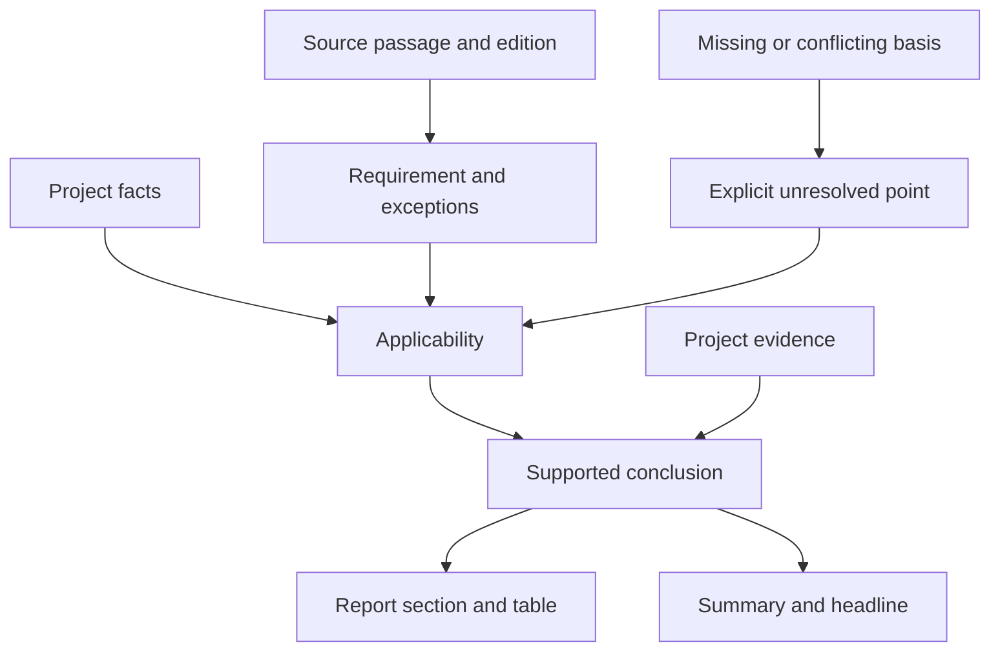

# Meaning maps and change impact

Version 1.2.0 adds an optional working method for interdependent writing: locate a material claim, record its grounds and conditions, and inspect the passages that depend on it when it changes. Ordinary writing still uses the compact core.

The inspiration is [diskd-ai Codespaces](https://github.com/diskd-ai/codespaces/tree/376738f09ac3884a7ee55b60ed89479f4d6c55d3): explicit relationships can help locate the effects of a change. Chtets does not copy a parser or run that project. A prose map is the model's fallible interpretation; unlike an import extracted from syntax, a semantic dependency may be ambiguous or unsupported. No graph database, Python runtime, automatic truth score, or extra service is introduced into writing tasks.

## Choose the mode

| Situation | Useful action |
| --- | --- |
| Routine email or isolated correction | Apply the core directly |
| A condition changes several conclusions | Trace its dependent passages |
| Several sources jointly support a conclusion | Record their distinct contributions and limits |
| Technical report with standards | Connect exact requirements, applicability, project evidence, and report sections |
| Deliberately ambiguous fiction | Preserve its design; do not force factual graph structure |
| Punctuation-only editing or locked quotation | Respect the editing permission; flag conflicts separately when material |

The [runtime reference](../skills/chtets/references/meaning-map.md) owns the procedure. Evidence reading remains in [evidence.md](../skills/chtets/references/evidence.md); the map does not duplicate source verification.

## Follow a changed basis

The arrows describe what must be examined, not proof that a conclusion is true. A source requirement and evidence of project compliance are different things. An edition, exception, referenced definition, or missing measurement can change the result. Do not choose a standard solely because its date is newer, and do not turn an unsigned protocol into a confirmed outcome.

After changing a premise, inspect all affected occurrences within the task's scope, including tables, captions, appendices, and summaries. Repair only affected passages, then read the result for meaning and readability. Return to the originals when the map and the text disagree. Stop when no material defect remains.

See the [worked example](../examples/meaning-map.md) for a denominator correction and a standards-based report pattern.

## Evidence and release boundary

This is a functional addition prepared for a forthcoming large report, not a measured claim of better writing. The earlier C2 dependent-span reminder produced five ties and one preference for the baseline on six reused pilot tasks; it did not establish a benefit. The new procedure adds explicit locations, bases, applicability, uncertainty, and cross-section checks, but those additions still need evaluation.

The [current check](../evaluations/meaning-map-v1/README.md) records synthetic tasks, source versions, outputs, and limitations. Real report work must still verify the actual documents and project facts. Keep private project evidence outside this public repository. Record a concrete failure or useful intervention before adding further rules; revise or remove the optional procedure if it causes over-editing or unnecessary work.
